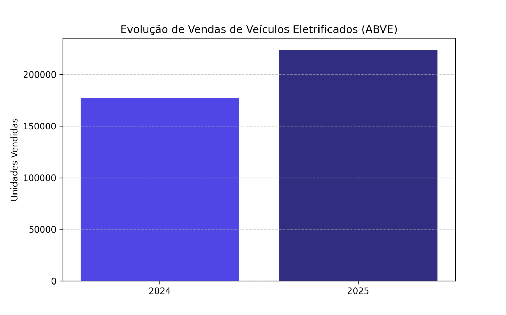
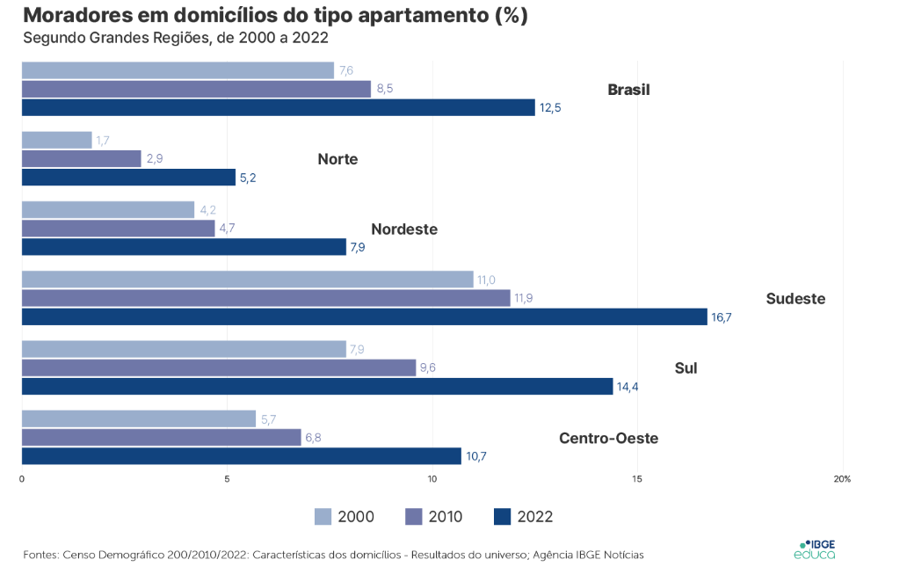

  <h1>Contexto do problema e pesquisa de dados</h1>

## 1. Crescimento dos veículos elétricos no Brasil

Nos últimos anos, o mercado de veículos elétricos no Brasil
cresceu de forma exponencial, de modo que se tornasse um mercado promissor para
se adentrar ou uma tendência para empresas relacionadas se adaptarem. Segundo
dados da ABVE (Associação Brasileira do Veículo Elétrico), o mercado de
veículos eletrificados leves no Brasil fechou 2025 com 223.912 unidades
vendidas, registrando um novo recorde anual da série histórica da ABVE e um
crescimento de 26% sobre os números de 2024 (177.358). 

*Fonte: ABVE (Associação Brasileira do Veículo Elétrico)*

Ademais, o ponto crucial para o planejamento urbano é que 81\%
dessa frota (181.542 veículos) é composta por modelos BEV e PHEV, os quais
dependem obrigatoriamente de recarga externa por tomada para circular. Além
disso, podemos perceber que áreas urbanas possuem uma concentração elevada de
veículos eletrificados se comparadas com as demais regiões brasileiras. A
região Sudeste lidera o cenário nacional de forma isolada, respondendo por
46,4% das vendas, impulsionada fortemente pelo estado de São Paulo, que
concentra sozinho 30,6% de todos os emplacamentos do país (mais de 68 mil
unidades).
 
Em síntese, a mobilidade elétrica surgiu a partir de uma
ideia revolucionária e benéfica para o meio ambiente, e hoje nós temos a
consolidação desse mercado no Brasil, visto que as vendas crescem de maneira rápida.
No entanto, o fato de 81% desses veículos vendidos em 2025 serem plug-in (PHEV
e BEV) cria um problema que possui urgência em sua resolução, pois toda essa
frota de carros plug-in precisa de recarga externa por tomada. No cenário
atual, nosso país não possui pontos de carregamento públicos suficientes para
assegurar essa demanda. Portanto, investir na infraestrutura de recarga e
analisar a capacidade energética tornaram-se passos essenciais para resolver de
uma vez por todas essa adversidade.

## 2. O Gargalo da Infraestrutura e a Verticalização
A expansão de veículos elétricos no nosso país está
diretamente atrelada a disponibilidade de infraestrutura de recarga, pois o
crescimento de ambos deve ser proporcional, assim como precisamos de veículos
para nos locomover, também necessitamos de pontos de carregamento que permitem
o andamento da locomoção. A respeito dos pontos de carregamento, eles devem ser
distribuídos em diferentes ambientes, desde residências até espaços públicos e
comerciais.
 
No nosso país, tivemos um avanço significativo no número de
unidades de pontos de carregamento que podem ser utilizados pela frota de
veículos. Em 2020, o número de unidades era de 350, que passou para 20 mil
unidades em apenas 5 anos. O desenvolvimento expressivo que tivemos nesse
período se deve principalmente a investimentos de diferentes agentes do mercado:
 
- empresas de energia;
- operadores de infraestrutura de recarga;
- redes de postos de combustível;
- empresas privadas interessadas em oferecer carregamento como serviço.
 
Apesar do crescimento na infraestrutura de recarga dos
veículos elétricos, ainda há uma concentração regional muito forte dessas
unidades de pontos de carregamento, que proporcionalmente, acompanham o acúmulo
de veículos elétricos em regiões urbanas, principalmente o sul e sudeste (São
Paulo, Distrito Federal, Rio de Janeiro, Minas Gerais, Paraná e Santa Catarina).

## 3. O Impacto Condominial e a Solução Tecnológica
Entre os anos 2000 e 2022, podemos analisar um aumento
significativo de brasileiros que residem em apartamentos, que no início da
pesquisa (feita pelo Censo Demográfico e divulgadas pelo IBGE - Instituto
Brasileiro de Geografia e Estatística) representava cerca de 7,6% e chegou a
12,5% no momento do estudo (2022). Ademais, todas as regiões do país tiveram um
aumento no número de pessoas que residem em apartamentos, porém o maior
percentual foi registrado no Sudeste (16%), seguido pelo Sul (14,4%), e o Norte
(5,2%) aparece com a menor porcentagem. Além disso, o material nos mostra que
171,3 milhões de pessoas moram em casas, o que equivale a 84,8% da população.

*Fonte: Censo Demográfico 2022 - IBGE*

Diante da impraticabilidade técnica de instalar um
carregador exclusivo para cada morador em garagens coletivas, se destaca o
modelo de recarga compartilhada. Nesse formato, estações de carregamento
são instaladas em áreas comuns ou vagas rotativas, permitindo que os condôminos
utilizem o ponto de energia de forma sequencial, ou seja, o usuário conecta o
veículo, realiza a recarga e, ao concluir, libera o espaço para o próximo
condômino. 
Embora este modelo otimize a infraestrutura existente, ele
transfere ao condomínio a responsabilidade de gerenciar o consumo e realizar a
bilhetagem individual, transformando a recarga em um serviço de utilidade
coletiva.
 
De acordo com esses dados, podemos perceber que o avanço dos
veículos elétricos já começa a impactar diretamente a rotina de condomínios residenciais
e comerciais e, com esse aumento na demanda por pontos de recarga, tanto os
síndicos quanto os moradores passam a lidar com novas adversidades que envolvem
as questões técnicas dos pontos de carregamento, questões jurídicas e de
convivência entre os residentes.
Nesse contexto, há de se perceber que a expansão de veículos
elétricos deixou de ser uma tendência e agora está presente na convivência dos
condomínios, resultando em um choque entre os interesses individuais e
coletivos. Esse conflito de interesses ocorre por conta desses fatores: 

- Vagas de garagem de uso privativo para esses pontos de carregamento (começaram a ser foco de questionamentos e conflitos jurídicos);
- Risco elétrico que prédios podem ter caso muitos veículos sejam carregados ao mesmo tempo, ocasionando na queda da energia da estrutura;
- Aumento da cobrança nas contas de energia para todos os moradores por conta do carregamento dos veículos elétricos.
 
Desse modo, para evitar o risco elétrico e promover uma
instalação correta dos carregadores, é preciso que sejam respeitados os
critérios adequados e que haja uma análise prévia da infraestrutura elétrica
dos empreendimentos. Segundo o engenheiro e empresário do setor, Milton Bigucci
Júnior, a definição das regras abordou um processo técnico amplo, com
participação de entidades do setor, além da realização de testes e simulações.

Com todos esses estudos feitos por especialistas, chegou-se
à conclusão de que uma das soluções destacadas para viabilizar a instalação nos
condomínios seria o balanceamento de carga, sistema no qual permite distribuir
o consumo de energia entre os veículos.

Além disso, o síndico tem um papel muito importante na
mediação desses conflitos entre os moradores e na solução do aumento da
cobrança de energia, em que deve dividir os custos da energia de forma justa,
caso contrário, ele pode responder criminalmente. Também é necessário que o
condomínio se antecipe aos pedidos e avalie previamente a viabilidade das
instalações, considerando o interesse dos moradores.

Outro ponto que gera dúvidas é a divisão de custos. A
legislação prevê que o morador interessado deve arcar com a instalação
individual, desde que cumpridas as exigências técnicas. No entanto, podem existir
diferentes possibilidades dentro dos condomínios, como a implementação de
custos individuais e coletivos, dependendo da solução adotada.

Portanto, de acordo com esse contexto, a recomendação
principal é de que devemos buscar o equilíbrio entre a inovação e a segurança.
Mesmo com o avanço significativo da frota de veículos elétricos, são necessárias
organização, responsabilidade técnica e diálogo entre os residentes antes de
fato realizar a sua implementação nos condomínios.

  <h1>Arquitetura e Base de Dados</h1>

## 1 Arquitetura da plataforma EV ChargeOps

### 1.1 Camada Física
A camada física é composta pelos componentes responsáveis pela geração e coleta de dados.

**1.1.1 Componentes**
* Carregador GoodWe HCA G2;
* Veículos eletricos;
* Sistema de autenticação RFID;
* Sensores e medidores de energia integrados ao carregador;

**1.1.2 Responsabilidades**
* Realizar tranferência de energia ao veículo;
* Receber energia do carregador;
* Identificar usuários autorizados;
* Registrar início e terminos de seções;
* Medir energia consumida;

**1.1.3 Dados Gerados**  
* Data/Hora: Momento da recarga;
* Usuário: Responsável pela sessão;
* Energia consumida: Quantidade em kWh;
* Potência: Potência instantanea;
* Duração: Tempo da sessão;
* Status:Em andamento, concçuída ou interrompida;

### 1.2 Camada de Conectividade
Esta camada é responsável pela comunicação entre o carregador e a plataforma.

**1.2.1 Interfaces Disponíveis**
* Wi-Fi: Permite a comunicação remota com intenet para envio de dados ao sistema;
* LAN: Oferece conexão estável para condomínios;
* Bluetooth: Utilizado para configuração local e manutenção;
* RFID: Identificação rápida de usuários autorizados;
* RS-485: Protocolo industrial para integração com outros dispositivos de automação;

**1.2.2 Responsabilidades**
* Transmitir dados para a nuvem;
* Garantir sincronização dos registros;
* Possibilitar monitoramento remoto;
* Integrar o carregador à plataforma;

### 1.3 Camada de Aplicação
A camada de aplicação representa o núcleo de processamento dos dados gerados e coletados.

**1.3.1 Componentes**
* API Back-end;
* Banco de Dados;
* Motor de Rateio;
* Sistema de faturamento;
* Inteligência artificial;

**1.3.2 Responsabilidade**
* Receber os dados da API GoodWe;
* Processar sessões de recarga;
* Armazenar informações históricas;
* Calcular cobranças;
* Gerar relatórios;
* Alimentar algorítimos de IA;

  <h1>Fontes e Referências</h1>

- **ABVE (Associação Brasileira do Veículo Elétrico):** [Eletrificados crescem dez vezes mais do que conjunto do mercado em 2025, com 224 mil veículos vendidos](https://abve.org.br/eletrificados-crescem-dez-vezes-mais-do-que-conjunto-do-mercado-em-2025-com-224-mil-veiculos-vendidos/)

- **Folha de S.Paulo:** [Rede de recarga cresce e tenta acompanhar alta nas vendas de carros elétricos](https://www1.folha.uol.com.br/colunas/eduardosodre/2026/06/rede-de-recarga-cresce-e-tenta-acompanhar-alta-nas-vendas-de-carros-eletricos.shtml)

- **Portal Solar:** [Mobilidade elétrica acelera no Brasil e abre nova frente de negócios para integradores de energia](https://www.portalsolar.com.br/noticias/tecnologia/mobilidade-eletrica/mobilidade-eletrica-acelera-no-brasil-e-abre-nova-frente-de-negocios-para-integradores-de-energia)

- **Jornal Cruzeiro do Sul:** [Instalação de carregadores de veículos elétricos é desafio para condomínios](https://www.jornalcruzeiro.com.br/sorocaba/noticias/2026/03/758883-instalacao-de-carregadores-de-veiculos-eletricos-e-desafio-para-condominios.html)

- **IstoÉ Dinheiro:** [Censo mostra que 84,8% dos brasileiros moram em casas e 12,5% em apartamentos](https://istoedinheiro.com.br/censo-mostra-que-848-dos-brasileiros-moram-em-casas-e-125-em-apartamentos)

- **IBGE:** [Características dos Domicílios – Censo 2022](https://educa.ibge.gov.br/jovens/conheca-o-brasil/populacao/22064-caracteristicas-dos-domicilios-censo-2022.html)
