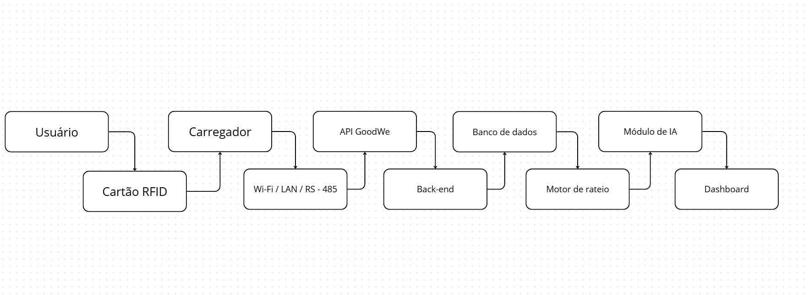
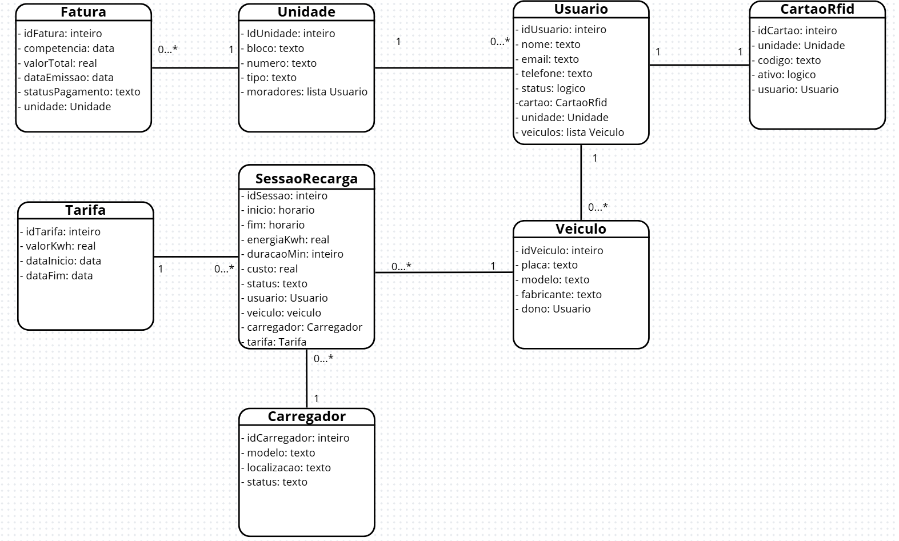
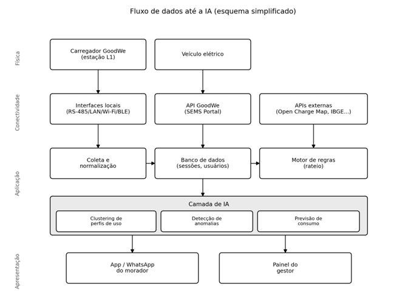

  <h1>Goodwe Energy Monitor
</h1>

## Integrantes da Equipe

Diego Ramos dos Santos -	RM 570889

Eduardo Ventura Rocha Soares - RM 570795

Heitor Assis Duenhas - RM 570472

José Rodrigues da Silva Júnior - RM 572300

Pedro Ribeiro Gesini - RM 469421

  <h1>Contexto do problema e pesquisa de dados</h1>

## 1. Crescimento dos veículos elétricos no Brasil

Nos últimos anos, o mercado de veículos elétricos no Brasil
cresceu de forma exponencial, de modo que se tornasse um mercado promissor para
se adentrar ou uma tendência para empresas relacionadas se adaptarem. Segundo
dados da ABVE (Associação Brasileira do Veículo Elétrico), o mercado de
veículos eletrificados leves no Brasil fechou 2025 com 223.912 unidades
vendidas, registrando um novo recorde anual da série histórica da ABVE e um
crescimento de 26% sobre os números de 2024 (177.358). 

*Fonte: ABVE (Associação Brasileira do Veículo Elétrico)*

Ademais, o ponto crucial para o planejamento urbano é que 81\%
dessa frota (181.542 veículos) é composta por modelos BEV e PHEV, os quais
dependem obrigatoriamente de recarga externa por tomada para circular. Além
disso, podemos perceber que áreas urbanas possuem uma concentração elevada de
veículos eletrificados se comparadas com as demais regiões brasileiras. A
região Sudeste lidera o cenário nacional de forma isolada, respondendo por
46,4% das vendas, impulsionada fortemente pelo estado de São Paulo, que
concentra sozinho 30,6% de todos os emplacamentos do país (mais de 68 mil
unidades).
 
Em síntese, a mobilidade elétrica surgiu a partir de uma
ideia revolucionária e benéfica para o meio ambiente, e hoje nós temos a
consolidação desse mercado no Brasil, visto que as vendas crescem de maneira rápida.
No entanto, o fato de 81% desses veículos vendidos em 2025 serem plug-in (PHEV
e BEV) cria um problema que possui urgência em sua resolução, pois toda essa
frota de carros plug-in precisa de recarga externa por tomada. No cenário
atual, nosso país não possui pontos de carregamento públicos suficientes para
assegurar essa demanda. Portanto, investir na infraestrutura de recarga e
analisar a capacidade energética tornaram-se passos essenciais para resolver de
uma vez por todas essa adversidade.

## 2. O Gargalo da Infraestrutura e a Verticalização
A expansão de veículos elétricos no nosso país está
diretamente atrelada a disponibilidade de infraestrutura de recarga, pois o
crescimento de ambos deve ser proporcional, assim como precisamos de veículos
para nos locomover, também necessitamos de pontos de carregamento que permitem
o andamento da locomoção. A respeito dos pontos de carregamento, eles devem ser
distribuídos em diferentes ambientes, desde residências até espaços públicos e
comerciais.
 
No nosso país, tivemos um avanço significativo no número de
unidades de pontos de carregamento que podem ser utilizados pela frota de
veículos. Em 2020, o número de unidades era de 350, que passou para 20 mil
unidades em apenas 5 anos. O desenvolvimento expressivo que tivemos nesse
período se deve principalmente a investimentos de diferentes agentes do mercado:
 
- empresas de energia;
- operadores de infraestrutura de recarga;
- redes de postos de combustível;
- empresas privadas interessadas em oferecer carregamento como serviço.
 
Apesar do crescimento na infraestrutura de recarga dos
veículos elétricos, ainda há uma concentração regional muito forte dessas
unidades de pontos de carregamento, que proporcionalmente, acompanham o acúmulo
de veículos elétricos em regiões urbanas, principalmente o sul e sudeste (São
Paulo, Distrito Federal, Rio de Janeiro, Minas Gerais, Paraná e Santa Catarina).

## 3. O Impacto Condominial e a Solução Tecnológica
Entre os anos 2000 e 2022, podemos analisar um aumento
significativo de brasileiros que residem em apartamentos, que no início da
pesquisa (feita pelo Censo Demográfico e divulgadas pelo IBGE - Instituto
Brasileiro de Geografia e Estatística) representava cerca de 7,6% e chegou a
12,5% no momento do estudo (2022). Ademais, todas as regiões do país tiveram um
aumento no número de pessoas que residem em apartamentos, porém o maior
percentual foi registrado no Sudeste (16%), seguido pelo Sul (14,4%), e o Norte
(5,2%) aparece com a menor porcentagem. Além disso, o material nos mostra que
171,3 milhões de pessoas moram em casas, o que equivale a 84,8% da população.

*Fonte: Censo Demográfico 2022 - IBGE*

Diante da impraticabilidade técnica de instalar um
carregador exclusivo para cada morador em garagens coletivas, se destaca o
modelo de recarga compartilhada. Nesse formato, estações de carregamento
são instaladas em áreas comuns ou vagas rotativas, permitindo que os condôminos
utilizem o ponto de energia de forma sequencial, ou seja, o usuário conecta o
veículo, realiza a recarga e, ao concluir, libera o espaço para o próximo
condômino. 
Embora este modelo otimize a infraestrutura existente, ele
transfere ao condomínio a responsabilidade de gerenciar o consumo e realizar a
bilhetagem individual, transformando a recarga em um serviço de utilidade
coletiva.
 
De acordo com esses dados, podemos perceber que o avanço dos
veículos elétricos já começa a impactar diretamente a rotina de condomínios residenciais
e comerciais e, com esse aumento na demanda por pontos de recarga, tanto os
síndicos quanto os moradores passam a lidar com novas adversidades que envolvem
as questões técnicas dos pontos de carregamento, questões jurídicas e de
convivência entre os residentes.
Nesse contexto, há de se perceber que a expansão de veículos
elétricos deixou de ser uma tendência e agora está presente na convivência dos
condomínios, resultando em um choque entre os interesses individuais e
coletivos. Esse conflito de interesses ocorre por conta desses fatores: 

- Vagas de garagem de uso privativo para esses pontos de carregamento (começaram a ser foco de questionamentos e conflitos jurídicos);
- Risco elétrico que prédios podem ter caso muitos veículos sejam carregados ao mesmo tempo, ocasionando na queda da energia da estrutura;
- Aumento da cobrança nas contas de energia para todos os moradores por conta do carregamento dos veículos elétricos.
 
Desse modo, para evitar o risco elétrico e promover uma
instalação correta dos carregadores, é preciso que sejam respeitados os
critérios adequados e que haja uma análise prévia da infraestrutura elétrica
dos empreendimentos. Segundo o engenheiro e empresário do setor, Milton Bigucci
Júnior, a definição das regras abordou um processo técnico amplo, com
participação de entidades do setor, além da realização de testes e simulações.

Com todos esses estudos feitos por especialistas, chegou-se
à conclusão de que uma das soluções destacadas para viabilizar a instalação nos
condomínios seria o balanceamento de carga, sistema no qual permite distribuir
o consumo de energia entre os veículos.

Além disso, o síndico tem um papel muito importante na
mediação desses conflitos entre os moradores e na solução do aumento da
cobrança de energia, em que deve dividir os custos da energia de forma justa,
caso contrário, ele pode responder criminalmente. Também é necessário que o
condomínio se antecipe aos pedidos e avalie previamente a viabilidade das
instalações, considerando o interesse dos moradores.

Outro ponto que gera dúvidas é a divisão de custos. A
legislação prevê que o morador interessado deve arcar com a instalação
individual, desde que cumpridas as exigências técnicas. No entanto, podem existir
diferentes possibilidades dentro dos condomínios, como a implementação de
custos individuais e coletivos, dependendo da solução adotada.

Portanto, de acordo com esse contexto, a recomendação
principal é de que devemos buscar o equilíbrio entre a inovação e a segurança.
Mesmo com o avanço significativo da frota de veículos elétricos, são necessárias
organização, responsabilidade técnica e diálogo entre os residentes antes de
fato realizar a sua implementação nos condomínios.

## 4. Funcionamento Técnico da Sessão de Recarga
Do ponto de vista técnico, uma sessão de recarga em infraestrutura compartilhada exige um fluxo rigoroso, tanto no quesito da comunicação, quanto em segurança. Tomando como base o carregador GoodWe HCA G2 que utilizaremos no projeto, o processo se inicia no momento em que o usuário pluga o cabo no veículo. Através de uma resistência no pino de controle (Control Pilot), o equipamento consegue detectar a conexão física e dá início ao chamado handshake. Nessa etapa preliminar, o carro e o carregador trocam dados via protocolo PWM (Pulse Width Modulation) para negociar a corrente máxima segura que a bateria pode absorver.

Como estamos lidando com o contexto de um ambiente compartilhado, a energia não flui imediatamente, pois o usuário precisa passar por uma etapa de autenticação (via cartão RFID ou aplicativo). Apenas após essa validação do perfil, o contator interno do carregador é fechado e a transferência de energia em corrente alternada (AC) começa. Durante todo esse período ativo, a máquina atua como um coletor de telemetria, capturando em tempo real a potência instantânea (kW), a voltagem, a corrente e, o mais importante para o nosso escopo, a energia total entregue (kWh). Ao final, seja por atingir a carga desejada ou por desconexão física, a sessão é encerrada e esse pacote de dados é enviado para o servidor na nuvem (SEMS Portal), fornecendo os insumos exatos para o cálculo da fatura.

## 5. Modelos de Negócio para Recarga Compartilhada
Para viabilizar financeiramente essa infraestrutura, o mercado global e o brasileiro têm adotado diferentes estratégias de cobrança:
- Recarga Gratuita: Geralmente é absorvida como despesa de marketing por estabelecimentos comerciais (shoppings e hotéis) para atrair clientes de alto poder aquisitivo. Portanto, é um modelo insustentável para a realidade dos condomínios residenciais.
- Cobrança por Tempo: Esse modelo é focado em garantir a alta rotatividade das vagas. O usuário paga uma taxa fixa por minuto/hora, o que o desestimula a abandonar o carro na vaga após a carga estar completa.
- Cobrança por kWh Consumido: É o padrão global e o modelo uqe melhor é inserido dentro do contexto dos condomínios. O morador paga exatamente pelo volume de energia que foi para o seu veículo, garantindo transparência financeira.
- Assinatura Mensal (Energy as a Service): O condomínio paga uma mensalidade fixa para uma operadora terceirizada, que fica responsável por assumir a gestão da infraestrutura, a manutenção do hardware e a operação do software de faturamento.
- Rateio Condominial Simples: A pior das opções operacionais, visto a falta de transparência com todos os condôminos. Isso acontece pois o custo da energia consumida pelo carregador da área comum cai na conta de luz geral e o síndico rateia o valor igualmente entre todos os moradores. Esse cenário gera extrema injustiça, pois obriga condôminos sem veículos elétricos a pagarem pelo consumo dos vizinhos.

  <h1>Pesquisa de mercado e análise de concorrentes</h1>

## 1. Chargepoint

### 1.1 Problema resolvido
A empresa analisada atua no desafio de propiciar aos condôminos um ambiente sustentável com a presença de veículos eletrificados, de modo que resolvam impasses como:
* Discussões acerca da baixa oferta de carregamentos veiculares em relação a alta demanda dos condôminos para usar tal tecnologia;
* Aumento da conta de luz sem um destinatário específico, causando revolta geral em todos os moradores em relação a alta;
*	Alta concentração de postos de carregamento sendo usados ao mesmo tempo, podendo gerar quedas gerais em prédios residenciais.

### 1.2 Principais funcionalidades
Para tais adversidades, a solução proposta pela Chargepoint se destaca pela união de recursos integrados de hardware e software, possibilitando:
* Gestão de vários cenários (gestão de vagas comuns e vagas privativas);
* Bilhetagem automatizada;
* Balanceamento de carga (evita custos elevados com a rede elétrica);
* Controle de acesso aos carregadores via nuvem;
* Painel de controle (ChargePoint Cloud) responsável por gerenciar o carregamento dos veículos e fornecer relatórios sobre consumo de energia;
* Processamento personalizado de pagamentos para residentes, hóspedes e carregamento pessoal.

### 1.3 Modelo de negócio
Em síntese, conseguimos deduzir que a Chargepoint gera renda com a produção de hardwares de carregamento, alinhados a softwares responsáveis por resolver problemas acerca da organização dos condôminos em relação as vagas de estacionamento, altos gastos com a rede elétrica e uma cobrança personalizada para residentes e hóspedes. Além disso, boa parte do faturamento deles se deve a cobrança de uma assinatura constante do condomínio para a liberação do acesso ao painel na nuvem.

### 1.4 Limitações da empresa
Por meio de um fórum que apresenta avaliações da empresa analisada, coletamos os contextos que cercam as avaliações feitas pelos consumidores:
* Vulnerabilidades graves de segurança: Muitos usuários relatam invasões as suas contas, problema esse que ocorreu por conta de um vazamento de dados, resultando em cobranças indevidas nos cartões de crédito dos clientes vinculados ao sistema. Além disso, a empresa demonstra ineficácia na resolução desses problemas e um grande descaso quando se trata do ressarcimento dos seus clientes afetados;

* Sistema de cobrança problemático: Outro alvo de críticas dos clientes são os sistemas de recarga automática, pois caso o usuário gaste um valor, o sistema bloqueia e recarrega automaticamente o mesmo valor no cartão e, ao alterar o plano para pagar apenas o que consome, tende a levar no mínimo um mês para ser efetivado. Além disso, o usuário pode encontrar problemas ao tentar desvincular dados do cartão de crédito;

* Atendimento precário ao cliente: E-mails enviados pelos clientes relatando problemas ou insatisfações sequer são lidos ou respondidos, também não há um canal telefônico eficiente e, segundo relatos de clientes, o atendimento parece ser terceirizado, com respostas automáticas que são ineficazes quando se trata da resolução das adversidades enfrentadas pelos clientes;

* Falhas técnicas no bloqueio de saldo: Foram relatadas falhas técnicas graves em como o software lida com sistemas de pagamento. Os usuários relatam se sentirem lesados, pois o sistema realiza a cobrança do cartão de crédito mesmo quando os pontos de recarga apresentam defeitos técnicos e não entregam energia.

A partir de uma análise minuciosa sobre todos esses pontos de vista debatidos, podemos chegar à conclusão de que a dependência excessiva de um ecossistema fechado pode gerar problemas sérios na área financeira e de suporte para os usuários da plataforma.

## 2. Wallbox

### 2.1 Problema resolvido
A Wallbox é responsável por oferecer soluções no desafio de integrar infraestrutura elétrica em espaços de convivência compartilhados, como é o caso dos prédios residenciais. Os problemas que cercam esses fatores são a escassez de espaço nas garagens e riscos de sobrecarga da energia do prédio em caso de utilização simultânea dos pontos de carregamento. Um diferencial apresentado para resolver todas essas adversidades listadas e ao mesmo tempo evitar transtornos para todos os condôminos e preservando a “boa vizinhança” é a eliminação de grandes reformas no prédio, que só é possível através de carregadores compactos e que estejam integrados a um software de gerenciamento em tempo real. Em síntese, eles conseguem resolver ao mesmo tempo a dificuldade na gestão do síndico, pois automatizam o controle de acesso e, consequentemente, a divisão correta das despesas geradas pelos pontos de carregamento.

### 2.2 Principais funcionalidades
Dentre as tecnologias desenvolvidas pela Wallbox que desempenham papel crucial na resolução das adversidades anteriormente citadas, se destacam:
* Software responsável pelo gerenciamento dos carregadores de veículos eletrificados contando com a Medição Certificada (MID), que garante precisão na contagem de energia gasta por cada usuário, permitindo relatórios exatos para reembolso e cobrança;

* Serviço de carregamento que oferece maior gestão da energia para diferentes cenários (carregadores individuais e coletivos), com destaque para o Gerenciamento Dinâmico de Carga (Power Sharing), que distribui a energia automaticamente entre os veículos conectados, evitando sobrecargas de pico no prédio;

* Carregadores diversificados com alta integração à condomínios, como o Pulsar Pro;

* Serviços com equipes especializadas que auxiliam durante todo o projeto até a sua execução;

* Linha de acessórios personalizada.

### 2.3 Modelo de negócio
O seu ganho de receita está situado na venda direta das suas estações físicas de carregamento, como o Pulsar Pro (possui tecnologia de medição e conectividade embarcada). Além disso, atuam em um modelo híbrido focado na venda direta de hardwares premium, que se complementa com o uso de softwares (Software as a Service – SaaS). No entanto, o seu faturamento de longo prazo se sustenta graças à assinatura que os condomínios pagam para desbloquear o painel na nuvem e, consequentemente, garantindo o acesso às funcionalidades descritas anteriormente.

### 2.4 Limitações da empresa
A partir da coleta de avaliações de clientes da empresa, podemos destacar as seguintes limitações:
* Descaso no suporte técnico e pós-venda: Usuários descrevem a demora no atendimento e em alguns casos em que há resposta por parte da empresa, não é apresentada nenhuma solução prática. Além disso, não há nenhum número de telefone, fazendo com que a comunicação entre os clientes dependa exclusivamente de e-mails lentos;

* Falhas críticas de software: O aplicativo é descrito pelos usuários como confuso e difícil de configurar, ocorrendo até mau funcionamento (e em outros casos desligamento total) logo após uma atualização automática de software;

* Falhas no hardware com o passar do tempo: Casos frequentes apontam que a confiabilidade das peças internas a médio prazo é considerada questionável. Um de seus principais atrativos para condomínios, que é o balanceamento de carga, apresentou falhas de comunicação com o tempo, o que reduziu drasticamente a eficiência da recarga sem aviso prévio.

## 3. Zaptec

### 3.1 Problema resolvido
A Zaptec foca em uma dor estrutural para a adoção de veículos eletrificados em condomínios: A limitação da infraestrutura elétrica já existente. Ou seja, a empresa analisada faz com que obras complexas e de alto custo, muito pela necessidade da troca de transformadores ou refazer todo o cabeamento do subsolo, sejam evitadas. A solução apresentada foca na otimização da rede, garantindo que dezenas de veículos possam ser conectados simultaneamente, sem que haja quedas de energia ou o sobrecarregamento da capacidade original do quadro elétrico do edifício. 

### 3.2 Principais funcionalidades
O núcleo da tecnologia da Zaptec é o seu sistema patenteado de balanceamento dinâmico de carga e fase. Analisando de forma prática, podemos dizer que é um software em nuvem que monitora o consumo do prédio em tempo real e distribui a energia desperdiçada entre os carros. O sistema é inteligente o suficiente para alternar fisicamente as conexões entre o modo monofásico e trifásico, nivelando a distribuição de energia para que os carregadores atinjam até 22 kW de potência máxima sem desarmar os disjuntores, entregando uma utilização até 66% superior da energia disponível.
Outro grande diferencial referente à praticidade na instalação em condomínios é a modularidade da instalação através da "placa traseira". Dessa forma, o condomínio pode preparar toda a infraestrutura da garagem de uma vez instalando apenas essa base nas vagas. Quando um morador adquire um veículo, basta comprar o corpo principal do carregador (Zaptec Pro) e encaixá-lo na placa, permitindo que o sistema cresça no ritmo da demanda sem novas intervenções elétricas.
Para fechar o pacote técnico, os aparelhos possuem conectividade independente (com rede 4G LTE-M própria e Wi-Fi), resolvendo a falta de sinal de internet em garagens subterrâneas e garantindo comunicação constante 24/7 com atualizações automáticas de software. Eles também possuem medidores integrados com certificação europeia (MID), trazendo uma verificação de consumo com precisão legal e evitando disputas entre moradores.

### 3.3 Modelo de negócio
A receita da empresa provém principalmente da venda do hardware premium (totens, placas e acessórios). Como estratégia para atrair condomínios, eles oferecem o software de gestão "Portal Zaptec" de forma gratuita.
Nesse modelo, a Zaptec não atua como uma operadora financeira. O portal funciona como um grande painel de auditoria que fica encarregado de analisar quem carregou (via autenticação no app) e quantos quilowatts-hora foram gastos. Fica sob responsabilidade da administração do condomínio exportar esses relatórios para adicionar o valor na taxa condominial, ou utilizar a API aberta da Zaptec e o protocolo OCPP 1.6J para conectar o sistema a um gateway de pagamento terceirizado que faça a cobrança automática.

### 3.4 Limitações da empresa
O ponto mais crítico da operação da Zaptec é o pós-venda e o suporte ao usuário final, área que acumula fortes reclamações. A principal problemática da empresa é a adoção de uma política de distanciamento do consumidor, escondendo telefones de contato e forçando o atendimento inicial por meio de uma assistente virtual que possui respostas limitadas e frequentemente bloqueia o avanço para um atendente humano.
O foco da empresa é atender apenas os instaladores parceiros. Com isso, há diversos relatos de usuários que ficam com o equipamento inoperante por dias devido a erros de sistema, recebendo apenas e-mails automatizados ou tendo o problema terceirizado para supostas falhas na rede da concessionária local. Além disso, a marca se recusa a fornecer suporte técnico caso o equipamento tenha sido comprado por canais não oficiais, demonstrando uma grande rigidez e falta de empatia na resolução de problemas do cliente final.

### Análise Competitiva de Mercado

| Critérios  | Zaptec | Wallbox | ChargePoint |
| :--- | :--- | :--- | :--- |
| **Segmentos de Clientes** | Condomínios com limitação na infraestrutura elétrica. | Prédios residenciais com escassez de espaço nas garagens. | Condôminos com alta demanda e necessidade de gestão de vagas comuns/privativas. |
| **Proposta de Valor** | Evitar obras complexas e otimizar a rede elétrica. | Carregadores compactos que evitam grandes reformas e facilitam a gestão do síndico. | União de hardware e software para bilhetagem automatizada e controle em nuvem. |
| **Fontes de Receita** | Venda de hardware premium (totens e placas) com portal gratuito. | Venda direta de equipamentos e assinatura de software (SaaS). | Produção de hardware e cobrança de assinatura constante para liberação do painel. |
| **Principais Funcionalidades** | Balanceamento dinâmico de fase, placa traseira modular, 4G nativo e medidor MID. | Medição Certificada (MID) e Gerenciamento Dinâmico de Carga (Power Sharing). | ChargePoint Cloud, controle de acesso e processamento personalizado de pagamentos. |
| **Limitações / Brechas** | Pós-venda inacessível ao cliente final e recusa de suporte para compras não oficiais. | Descaso no suporte técnico, falhas críticas de software/app e desgaste do hardware. | Vazamento de dados, falhas no bloqueio de saldo e atendimento terceirizado ineficaz. |

  <h1>Viabilidade Legal e Técnica da Solução</h1>

## 1. Mapeamento Regulatório 

Para assegurar a operação dos carregadores compartilhados no Brasil e, mais especificamente, no Estado de São Paulo, o projeto EV ChargeOps foi desenhado para atuar em total conformidade com as diretrizes federais, estaduais e normas técnicas de segurança.

No âmbito federal, a Resolução Normativa nº 1.000/2021 da ANEEL é o pilar que regulamenta a exploração comercial da recarga. A norma estabelece que o consumo de cada usuário deve ser individualizado e que a instalação não pode comprometer a rede do condomínio, exigindo comunicação prévia à distribuidora em caso de aumento de carga. Além disso, recomenda o uso de protocolos abertos de comunicação para equipamentos de uso coletivo. Nossa plataforma atende a essa RN ao garantir a individualização exata do consumo e utilizar o hardware para gerenciar a demanda, mitigando o risco de faturamento injusto (rateio simples) e sobrecarga.

Para o aprofundamento estadual (São Paulo), analisamos a Lei Estadual nº 18.403/2026, que garante o direito dos condôminos de instalarem infraestrutura de recarga, mas impõe severas restrições técnicas (necessidade de laudo, ART e aprovação do síndico para evitar o colapso elétrico). A solução EV ChargeOps posiciona-se como a ferramenta ideal para os síndicos aplicarem essa lei de forma segura, justificando aprovações através do balanceamento dinâmico de carga.

Ainda no cenário paulista, a segurança estrutural é balizada pela Diretriz Nacional SAVE (Portaria nº 029/2025 da LIGABOM) e pela Instrução Técnica nº 17/2025 do Corpo de Bombeiros de SP (CBMESP). Para manter o Auto de Vistoria do Corpo de Bombeiros (AVCB), a instalação exige distanciamento mínimo de 5 metros das rotas de fuga, botões de desligamento manual acessíveis e integração com alarmes. O monitoramento em tempo real do nosso software atua como uma camada preventiva essencial contra o estresse térmico da fiação, alinhando-se às exigências dos Bombeiros.

## 2. Carregador GoodWe HCA G2 e Interfaces de Comunicação

A viabilidade técnica do projeto sustenta-se no uso do carregador inteligente em corrente alternada (AC) GoodWe HCA G2. O equipamento oferece proteção IP66, integração fotovoltaica e balanceamento dinâmico de carga. Para operar, a plataforma pode utilizar as seguintes interfaces de comunicação nativas do equipamento:

- Wi-Fi e Bluetooth: Permitem a configuração local e comunicação remota sem fios. Contudo, devido à altíssima incidência de interferências e "zonas cegas" comuns em garagens subterrâneas (concreto armado), são menos indicadas para o monitoramento contínuo da plataforma.

- LAN (Ethernet): Oferece conexão cabeada estável, de alta velocidade e baixa latência. É a interface recomendada para o envio seguro dos dados do servidor local do condomínio para a nuvem.

- RS-485: Protocolo industrial de altíssima confiabilidade. Permite comunicação de até 1.200 metros com excelente imunidade a ruídos elétricos, sendo a interface principal escolhida pela nossa arquitetura para conectar os totens de recarga ao gateway central na garagem.

- RFID: Interface vital para a cobrança automatizada. Permite que o morador encoste uma tag ou cartão, garantindo a identificação rápida e segura do usuário autorizado e associando instantaneamente a sessão de recarga à sua respectiva fatura.

## 3. Extração de Dados: API GoodWe (SEMS Portal)

A inteligência de rateio e monitoramento do EV ChargeOps depende da extração dos dados gerados durante o fornecimento de energia. Como os carregadores HCA G2 sincronizam sua telemetria com a nuvem, o nosso sistema consome essas informações diretamente através da documentação pública da API do SEMS Portal.

Os dados fundamentais expostos por essa API, que alimentam o motor de regras da nossa plataforma, incluem:

- Status do Carregador: Informa se a máquina está ociosa, carregando, offline ou em falha, permitindo manutenções preditivas.

- Potência (kW): A captura da potência instantânea é essencial para o algoritmo de balanceamento, evitando que a soma das recargas desarme os disjuntores do prédio.

- Energia Entregue (kWh): É a métrica mais importante para a bilhetagem. A API expõe o volume exato de energia transferida, garantindo que o morador pague apenas pelo que consumiu.

- Eventos de Sessão: Registros de início e fim da recarga (vinculados ao RFID), tempo total conectado e histórico de utilização, fundamentais para compor relatórios de auditoria e alimentar os futuros modelos de Inteligência Artificial da plataforma.

  <h1>Arquitetura e Base de Dados</h1>

## 1 Arquitetura da plataforma EV ChargeOps

### 1.1 Camada Física
A camada física é composta pelos componentes responsáveis pela geração e coleta de dados.

**1.1.1 Componentes**
* Carregador GoodWe HCA G2;
* Veículos eletricos;
* Sistema de autenticação RFID;
* Sensores e medidores de energia integrados ao carregador;

**1.1.2 Responsabilidades**
* Realizar tranferência de energia ao veículo;
* Receber energia do carregador;
* Identificar usuários autorizados;
* Registrar início e terminos de seções;
* Medir energia consumida;

**1.1.3 Dados Gerados**  
* Data/Hora: Momento da recarga;
* Usuário: Responsável pela sessão;
* Energia consumida: Quantidade em kWh;
* Potência: Potência instantanea;
* Duração: Tempo da sessão;
* Status:Em andamento, concçuída ou interrompida;

### 1.2 Camada de Conectividade
Esta camada é responsável pela comunicação entre o carregador e a plataforma.

**1.2.1 Interfaces Disponíveis**
* Wi-Fi: Permite a comunicação remota com intenet para envio de dados ao sistema;
* LAN: Oferece conexão estável para condomínios;
* Bluetooth: Utilizado para configuração local e manutenção;
* RFID: Identificação rápida de usuários autorizados;
* RS-485: Protocolo industrial para integração com outros dispositivos de automação;

**1.2.2 Responsabilidades**
* Transmitir dados para a nuvem;
* Garantir sincronização dos registros;
* Possibilitar monitoramento remoto;
* Integrar o carregador à plataforma;

### 1.3 Camada de Aplicação
A camada de aplicação representa o núcleo de processamento dos dados gerados e coletados.

**1.3.1 Componentes**
* API Back-end;
* Banco de Dados;
* Motor de Rateio;
* Sistema de faturamento;
* Inteligência artificial;

**1.3.2 Responsabilidade**
* Receber os dados da API GoodWe;
* Processar sessões de recarga;
* Armazenar informações históricas;
* Calcular cobranças;
* Gerar relatórios;
* Alimentar algorítimos de IA;

### 1.4 Camada de Apresentação
É a camada que chega aos usuários finais.

**1.4.1 Portal do Morador**  
Funcionalidades:
* Consultar histórico de recargas;
* Visualizar consumo;
* acompanhar faturas;
* Receber notificações;

**1.4.2 Portal do Gestor**  
Funcionalidades:
* Monitorar carregadores;
* Gerenciar usuários;
* Configurar tarifas;
* Acompanhar indicadores;

## 2 Fluxo de dados da plataforma

### 2.1 Etapas
- Autenticação: O usuário aproxima o cartão RFID do carregador.  O sistema registra o ID do usuário, a data e o horário;
- Início da recarga: O carregardo transfere energia para o veículo. O sistema registra a potência inicial e o identificador da sessão;
- Coleta de dados: Durante a recarga são coletados a energia consumida, potência, tempo de utilização e eventos operacionais;
- Envio para a API GoodWe: Os dados são enviados para o portal SEMS da GoodWe;
- Processamento no EV ChargOps: A plataforma recebe os dados e valida a sessão, relaciona o usuário à unidade, calcula o consumo e atualiza histórico;
- Rateio e faturamento: O sistma aplica as regras de cobrança resultando em valor devido, consumo mensal, relatórios financeiros;
- Inteligência artificial: Os dados históricos alimentam os modelos analíticos. A ia Fará previsões, alertas e recomendações;

### 2.2 Fluxograma

## 3 Modelo de Rateio

### 3.1 Variáveis
* Energia consumida: kWh utilizados;
* Tarifa: valor po kWh;

### 3.2 Fórmula
valor da sessão = energia consumida x tarifa

**Exemplo:**  
energiaConsumida = 32
tarifa = 0.9

valorDaSessao = 28.80

### 3.3 Casos Excepcionais

**Sessão interrompida**  
Cobrança proporcional ao consumo registrado

**Usuário sem recarga no mês**  
Fatura zerada

**Dois veículos na mesma unidade**  
Os consumos são somados na mesma fatura

## 4 Esquema da Base de Dados

### Unidade
| idUnidade | bloco | numero | tipo        |
| --------- | ----- | ------ | ----------- |
| 1         | A     | 101    | Apartamento |
| 2         | A     | 102    | Apartamento |
| 3         | B     | 201    | Apartamento |

### Usuário
| idUsuario | nome            | email                                       | telefone    | status  | idUnidade |
| --------- | --------------- | ------------------------------------------- | ----------- | ------- | --------- |
| 1         | João Silva      | [joao@email.com](mailto:joao@email.com)     | 11999990001 | Ativo   | 1         |
| 2         | Maria Souza     | [maria@email.com](mailto:maria@email.com)   | 11999990002 | Ativo   | 1         |
| 3         | Carlos Oliveira | [carlos@email.com](mailto:carlos@email.com) | 11999990003 | Ativo   | 2         |
| 4         | Ana Costa       | [ana@email.com](mailto:ana@email.com)       | 11999990004 | Inativo | 3         |

### Veículo
| idVeiculo | placa   | modelo       | fabricante | idUsuario |
| --------- | ------- | ------------ | ---------- | --------- |
| 1         | ABC1D23 | Dolphin Mini | BYD        | 1         |
| 2         | DEF4G56 | Dolphin Plus | BYD        | 2         |
| 3         | HIJ7K89 | Model 3      | Tesla      | 3         |
| 4         | LMN0P12 | Ora 03       | GWM        | 4         |

### Carregador
| idCarregador | modelo        | localizacao     | status      |
| ------------ | ------------- | --------------- | ----------- |
| 1            | GoodWe HCA G2 | Garagem Bloco A | Disponível  |
| 2            | GoodWe HCA G2 | Garagem Bloco B | Em Operação |

### Tarifa
| idTarifa | valorKwh | dataInicio | dataFim    |
| -------- | -------- | ---------- | ---------- |
| 1        | 0,90     | 01/01/2026 | 30/06/2026 |
| 2        | 1,05     | 01/07/2026 | 31/12/2026 |

### Sessão de Recarga
| idSessao | inicio           | fim              | energiaKwh | duracaoMin | custo | status       | idUsuario | idVeiculo | idCarregador | idTarifa |
| -------- | ---------------- | ---------------- | ---------- | ---------- | ----- | ------------ | --------- | --------- | ------------ | -------- |
| 1        | 15/06/2026 18:00 | 15/06/2026 21:00 | 32,0       | 180        | 28,80 | Concluída    | 1         | 1         | 1            | 1        |
| 2        | 16/06/2026 19:30 | 16/06/2026 22:00 | 24,5       | 150        | 22,05 | Concluída    | 2         | 2         | 1            | 1        |
| 3        | 17/06/2026 20:00 | 17/06/2026 23:20 | 38,0       | 200        | 34,20 | Concluída    | 3         | 3         | 2            | 1        |
| 4        | 18/06/2026 22:15 | 18/06/2026 23:45 | 15,0       | 90         | 13,50 | Interrompida | 1         | 1         | 1            | 1        |

### Fatura
| idFatura | competencia | valorTotal | dataEmissao | statusPagamento | idUnidade |
| -------- | ----------- | ---------- | ----------- | --------------- | --------- |
| 1        | Junho/2026  | 64,35      | 30/06/2026  | Pendente        | 1         |
| 2        | Junho/2026  | 34,20      | 30/06/2026  | Pago            | 2         |
| 3        | Junho/2026  | 0,00       | 30/06/2026  | Não Gerada      | 3         |

# EV ChargeOps - Papel da Inteligência Artificial na Plataforma

## 1. Introdução
Este documento corresponde à Frente 3 do desafio EV ChargeOps, na opção de aprofundamento B, que solicita a definição do papel da Inteligência Artificial dentro da plataforma. O enunciado pede ao menos duas abordagens de IA aplicáveis ao problema, com indicação da técnica envolvida, dos dados necessários e do impacto esperado de cada uma. Foram selecionadas três abordagens, por se entender que o problema de gestão de recarga compartilhada apresenta pelo menos três momentos distintos de decisão, cada um exigindo uma técnica diferente.

A análise apresentada baseia-se em pesquisa bibliográfica sobre as técnicas e em documentação pública do equipamento envolvido (carregador GoodWe HCA G2), não havendo, até o momento, acesso a dados reais de uso do equipamento instalado no Energy Innovation Lab da FIAP.

As três abordagens tratadas são: clustering de perfis de uso, detecção de anomalias e previsão de consumo. As três operam sobre os mesmos dados básicos de sessão de recarga (duração, energia entregue e horário), mas cada uma responde a uma pergunta distinta sobre esses dados.

| Abordagem | Pergunta que busca responder |
| :--- | :--- |
| Clustering de perfis de uso | Que tipo de usuário é esse? |
| Detecção de anomalias | Essa sessão é normal ou apresenta indício de problema? |
| Previsão de consumo | Quanto será consumido no próximo período? |

Tabela 1 - Abordagens de IA selecionadas.

## 2. Posição da IA no fluxo de dados
Antes de detalhar cada abordagem, situa-se a camada de IA dentro da arquitetura geral da plataforma. O diagrama a seguir segue a divisão em camadas proposta no desafio (física, conectividade, aplicação e apresentação), posicionando a IA entre a camada de aplicação e a camada de apresentação, uma vez que ela depende dos dados já processados pelo banco de dados e pelo motor de regras de rateio, e devolve resultados tanto para esse motor quanto para as interfaces do usuário e do gestor.

Figura 1-Arquitetura em camadas e posição da IA no fluxo de dados.

Trata-se de uma primeira versão do esquema, sujeita a ajustes na Sprint 02 conforme a integração entre a camada de IA e o motor de rateio for detalhada com mais precisão.

## 3. Clustering de perfis de uso
Esta é a abordagem definida como principal, a ser priorizada caso o grupo opte por implementar IA de fato na Sprint 02.

**Problema que pretende resolver**
Em um condomínio ou campus com carregador compartilhado, os usuários não utilizam o equipamento da mesma forma. Há perfis de uso quase diário, perfis de uso esporádico e perfis concentrados em determinados horários. Tratar todos os usuários de modo uniforme no rateio e na comunicação não reflete o uso real de cada um. O clustering tem como função agrupar os usuários por padrão de uso sem que seja necessário definir essas categorias manualmente.

**Técnica**
Trata-se de uma técnica de aprendizado não supervisionado. O algoritmo K-Means é indicado como ponto de partida, por ser de implementação e interpretação mais simples. O DBSCAN é apontado na literatura como alternativa para os casos em que os grupos não apresentam separação bem definida. A proposta para a Sprint 02 é iniciar pelo K-Means, considerando o DBSCAN apenas se o resultado inicial não se mostrar satisfatório.

**Dados necessários**
* Duração média das sessões de cada usuário.
* Energia entregue por sessão e por mês.
* Horário predominante de uso.
* Frequência semanal ou mensal de utilização do carregador.

**Impacto esperado**
Espera-se que o resultado do clustering possa ser utilizado tanto no modelo de rateio, aplicando critérios diferenciados por perfil, quanto na comunicação com o usuário, personalizando mensagens conforme o padrão de uso identificado. Por não haver ainda dados reais suficientes, trata-se de uma expectativa fundamentada na pesquisa realizada, e não de um resultado validado.

## 4. Detecção de anomalias
A segunda abordagem trata de situações em que algo na sessão de recarga sai do padrão esperado, e que um sistema sem verificação automática não seria capaz de identificar a tempo.

**Problema que pretende resolver**
Sessões de recarga podem apresentar falhas que não são evidentes apenas observando os dados brutos: uma sessão pode não ser encerrada corretamente, um sensor pode reportar um valor de energia inconsistente, ou um padrão de uso pode mudar de forma abrupta, como no caso de dois veículos sendo carregados sob o mesmo cadastro.Sem verificação automática, essas situações tendem a ser percebidas apenas quando o morador questiona a fatura, o que já representa um problema consolidado.

**Técnica**
A técnica considerada é o Isolation Forest, frequentemente citada na literatura para detecção de anomalias multivariadas, por conseguir tratar diversas variáveis simultaneamente. Como alternativa mais simples para uma primeira validação, considera-se também o cálculo de desvio em relação à média histórica de cada usuário (z-score), de implementação e interpretação mais diretas, ainda que menos sofisticado.

**Dados necessários**
* Duração e energia da sessão, comparadas ao histórico do mesmo usuário.
* Potência reportada durante a sessão, quando disponibilizada pela API.
* Registro de sessões não encerradas normalmente.

**Impacto esperado**
Sessões classificadas como fora do padrão não devem ser incorporadas automaticamente ao cálculo do rateio, mas sinalizadas para revisão do gestor. Essa verificação deve funcionar como alerta, e não como bloqueio automático, de modo a evitar que um uso legítimo, porém atípico, seja tratado como erro sem revisão humana.

## 5. Previsão de consumo
A terceira abordagem é considerada a mais incerta das três, por depender de um histórico de dados que ainda não está disponível.

**Problema que pretende resolver**
Gestores de condomínios e campus precisam de planejamento financeiro, e o consumo associado à recarga de veículos elétricos tende a crescer ao longo do tempo. Sem uma estimativa, o aumento do consumo só é percebido quando a fatura de energia já refletir essa mudança.

**Técnica**
A técnica considerada é a regressão, partindo de um modelo de regressão linear simples, com variáveis como número de veículos cadastrados e indicadores de sazonalidade (mês, dia da semana). Modelos mais complexos de série temporal não foram aprofundados nesta fase, por não se justificarem diante do volume de dados disponível, proveniente de um único carregador.

**Dados necessários**
* Histórico de consumo mensal, ainda inexistente em dados reais.
* Número de veículos cadastrados ativos.
* Indicadores de sazonalidade (mês, período de aula, entre outros).

**Impacto esperado**
Caso seja implementada, a previsão de consumo permitiria ao gestor antecipar aumentos no consumo de energia. Trata-se, no entanto, da abordagem mais frágil das três, por depender de dados que atualmente não existem, sendo por isso classificada como de menor prioridade, a ser implementada apenas se houver tempo disponível na Sprint 02.

## 6. Comparação entre as abordagens
A tabela a seguir resume os critérios que fundamentam a priorização do clustering como abordagem principal.

| Critério | Clustering | Anomalias | Previsão |
| :--- | :--- | :--- | :--- |
| Tipo de aprendizado | Não supervisionado | Estatístico | Supervisionado |
| Dependência de histórico extenso | Moderada | Baixa | Alta |
| Complexidade de implementação | Baixa a média | Média | Baixa a média |
| Prioridade na Sprint 02 | Alta | Média | Baixa |

Tabela 2- Comparação entre as três abordagens.

O clustering é priorizado por se conectar diretamente ao modelo de rateio, critério com maior peso na avaliação do desafio. A detecção de anomalias ocupa a segunda posição por proteger a qualidade dos dados que alimentam o próprio clustering e o rateio. A previsão de consumo é classificada como de menor prioridade pela baixa confiabilidade esperada, em razão do volume limitado de dados disponível no prazo da Sprint 02.

## 7. Limitações identificadas
A seguir são registradas as principais limitações da proposta, de modo a evidenciar leitura crítica sobre as escolhas técnicas apresentadas.

* O Energy Innovation Lab da FIAP dispõe de apenas um carregador instalado, o que implica testar as três técnicas inicialmente com dados simulados, já que dados reais em volume suficiente ainda não existem.
* Não há experiência prévia de implementação das três técnicas por parte do integrante responsável por esta frente, o que pode resultar em ajustes de abordagem durante a Sprint 02.
* A detecção de anomalias apresenta risco de classificar uso legítimo, porém atípico, como erro. Por esse motivo, define-se que o resultado deve gerar alerta para revisão humana, e não ação automática.
* A previsão de consumo é a abordagem mais frágil das três em razão da falta de histórico, sendo a primeira a ser descartada caso o tempo disponível na Sprint 02 seja insuficiente.

## 8. Encaminhamentos para a Sprint 02
A sequência proposta para o desenvolvimento desta frente na próxima sprint é a seguinte:

* Geração de uma base de dados simulada de sessões de recarga, em articulação com a Frente 3, Opção C.
* Organização dos dados em variáveis por usuário (duração média, energia, horário, frequência).
* Implementação do clustering, com avaliação da consistência dos grupos obtidos.
* Implementação da detecção de anomalias sobre a mesma base de dados.
* Implementação da previsão de consumo, condicionada à disponibilidade de tempo.

  <h1>Plano para a Sprint 02 (Desenvolvimento e Prototipação)</h1>

### 1. Visão Geral
Além da modelagem algorítmica iniciada na Sprint 01, a Sprint 02 contemplará a construção completa do sistema. O back-end e o motor de rateio corporativo serão desenvolvidos em Python (utilizando o framework FastAPI), garantindo integração nativa com os modelos de Inteligência Artificial (Scikit-Learn) e alta performance na comunicação com a API da GoodWe. A camada de apresentação (Portal do Morador e Gestor) será construída em React, enquanto os dados transacionais de consumo e faturamento serão guardados em um banco de dados relacional PostgreSQL, assegurando a integridade financeira do rateio.

### 2. Cronograma de Execução
O desenvolvimento seguirá uma abordagem ágil, organizada nas seguintes etapas:

* **Etapa 1: Estruturação do Banco de Dados e Back-end**
  - Criação do esquema do banco de dados relacional e desenvolvimento da API central para autenticação e rotas principais.
  
* **Etapa 2: Integração com a API GoodWe e Motor de Rateio**
  - Desenvolvimento dos scripts de extração de dados do SEMS Portal e implementação da lógica de cálculo de Consumo x Tarifa.

* **Etapa 3: Implementação da Camada de IA**
  - Construção do modelo de Clustering (K-Means) para perfis de uso e lógica de detecção de anomalias (Isolation Forest) integrada à API principal.

* **Etapa 4: Camada de Apresentação (Frontend)**
  - Desenvolvimento das interfaces visuais do Portal do Gestor e Portal do Morador, com uso de bibliotecas de gráficos para exibição de indicadores.

* **Etapa 5: Validação, Testes e Pitch**
  - Testes de integração, correção de bugs de performance e roteirização/gravação do vídeo pitch de 3 minutos para a avaliação presencial.

  <h1>Fontes e Referências</h1>

- **ABVE (Associação Brasileira do Veículo Elétrico):** [Eletrificados crescem dez vezes mais do que conjunto do mercado em 2025, com 224 mil veículos vendidos](https://abve.org.br/eletrificados-crescem-dez-vezes-mais-do-que-conjunto-do-mercado-em-2025-com-224-mil-veiculos-vendidos/)

- **Folha de S.Paulo:** [Rede de recarga cresce e tenta acompanhar alta nas vendas de carros elétricos](https://www1.folha.uol.com.br/colunas/eduardosodre/2026/06/rede-de-recarga-cresce-e-tenta-acompanhar-alta-nas-vendas-de-carros-eletricos.shtml)

- **Portal Solar:** [Mobilidade elétrica acelera no Brasil e abre nova frente de negócios para integradores de energia](https://www.portalsolar.com.br/noticias/tecnologia/mobilidade-eletrica/mobilidade-eletrica-acelera-no-brasil-e-abre-nova-frente-de-negocios-para-integradores-de-energia)

- **Jornal Cruzeiro do Sul:** [Instalação de carregadores de veículos elétricos é desafio para condomínios](https://www.jornalcruzeiro.com.br/sorocaba/noticias/2026/03/758883-instalacao-de-carregadores-de-veiculos-eletricos-e-desafio-para-condominios.html)

- **IstoÉ Dinheiro:** [Censo mostra que 84,8% dos brasileiros moram em casas e 12,5% em apartamentos](https://istoedinheiro.com.br/censo-mostra-que-848-dos-brasileiros-moram-em-casas-e-125-em-apartamentos)

- **IBGE:** [Características dos Domicílios – Censo 2022](https://educa.ibge.gov.br/jovens/conheca-o-brasil/populacao/22064-caracteristicas-dos-domicilios-censo-2022.html)

- **Wallbox:** [Pulsar Pro Home Charger Reimbursement](https://wallbox.com/en/pulsar-pro-home-charger-reimbursement)

- **ChargePoint:** [EV Charging Solutions for Condos](https://www.chargepoint.com/solutions/condos)

- **Trustpilot:** [Avaliações de Clientes - ChargePoint](https://www.trustpilot.com/review/chargepoint.com?page=2)

- **Trustpilot:** [Avaliações de Clientes - Wallbox](https://www.trustpilot.com/review/wallbox.com)

- **Wallbox:** [EV Charging for Condominiums](https://wallbox.com/en/ev-charging-condominiums)

- **Zaptec:** [Zaptec Pro - Business and Commercial Charging Solutions](https://www.zaptec.com/charging-solutions/business-and-commercial/zaptec-pro)

- **Trustpilot:** [Avaliações de Clientes - Zaptec](https://www.trustpilot.com/review/zaptec.com)

- **GoodWe:** [SEMS Portal](https://semsplus.goodwe.com/)

- **Scikit-Learn:** [Clustering](https://scikit-learn.org/stable/modules/clustering.html)

- **Scikit-Learn:** [Outlier and novelty detection](https://scikit-learn.org/stable/modules/outlier_detection.html)

- **Scikit-Learn:** [Linear models](https://scikit-learn.org/stable/modules/linear_model.html)

- **Agência Nacional de Energia Elétrica (ANEEL):** [Resolução Normativa nº 1.000/2021](https://www.aneel.gov.br/)
